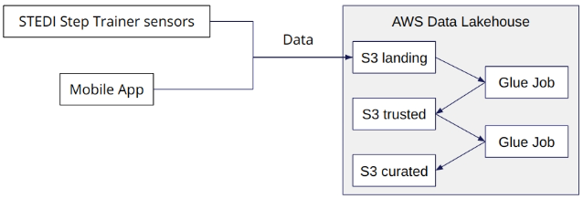

# Project: STEDI Human Balance Analytics 📊🧘‍♂️

## 📃 Project Summary

This project aims to extract the data produced by the STEDI Step Trainer sensors and the mobile app, and curate them into a data lakehouse solution on AWS.

## 🎯 Objectives

Develop Python scripts to build a lakehouse solution, implementing the following workflow:



## 📂 Project Data

STEDI has three JSON data sources to use from the Step Trainer:

| Name          | URL                                                                                                                                       | S3 URI                           |
| ------------- | ----------------------------------------------------------------------------------------------------------------------------------------- | -------------------------------- |
| customer      | [Github Link](https://github.com/udacity/nd027-Data-Engineering-Data-Lakes-AWS-Exercises/tree/main/project/starter/customer/landing)      | s3://cd0030bucket/customers/     |
| step_trainer  | [Github Link](https://github.com/udacity/nd027-Data-Engineering-Data-Lakes-AWS-Exercises/tree/main/project/starter/step_trainer/landing)  | s3://cd0030bucket/step_trainer/  |
| accelerometer | [Github Link](https://github.com/udacity/nd027-Data-Engineering-Data-Lakes-AWS-Exercises/tree/main/project/starter/accelerometer/landing) | s3://cd0030bucket/accelerometer/ |


## 🎨 Installation

1. In the AWS CLI, create an S3 Bucket : `aws s3 mb s3://<YOUR BUCKET NAME>`

For Glue Jobs to have network access to S3, you need to create an **S3 Gateway Endpoint** . It requires 2 elements.

2. Identify which VPC needs access to S3 : `aws ec2 describe-vpcs` (look for the **VpcId**)
3. Identify the routing table you want to configure with your VPC Gateway: `aws ec2 describe-route-tables` (look for the **RouteTableId**)
4. Finally, you can create the S3 Gateway : `aws ec2 create-vpc-endpoint --vpc-id <YOUR VPC ID> --service-name com.amazonaws.us-east-1.s3 --route-table-ids <YOUR ROUTING ID>`

For AWS Glue to access S3, you also need to create an IAM Service Role that can be assumed by Glue. (similar to user privileges)  

5. Create an IAM Service Role: 
```
aws iam create-role --role-name <GLUE-SERVICE-ROLE-NAME> --assume-role-policy-document '{
    "Version": "2012-10-17",
    "Statement": [
        {
            "Effect": "Allow",
            "Principal": {
                "Service": "glue.amazonaws.com"
            },
            "Action": "sts:AssumeRole"
        }
    ]
}'
```
6. Grant Glue Privileges (read/write/delete access to the bucket and everything in it) on the S3 Bucket:
```
aws iam put-role-policy --role-name <GLUE-SERVICE-ROLE-NAME> --policy-name S3Access --policy-document '{ "Version": "2012-10-17", "Statement": [ { "Sid": "ListObjectsInBucket", "Effect": "Allow", "Action": [ "s3:ListBucket" ], "Resource": [ "arn:aws:s3:::<YOUR BUCKET NAME>" ] }, { "Sid": "AllObjectActions", "Effect": "Allow", "Action": "s3:*Object", "Resource": [ "arn:aws:s3:::<YOUR BUCKET NAME>/*" ] } ] }'
```
7. Grant Glue access to data in special S3 buckets used for Glue configuration, and several other resources:
```
aws iam put-role-policy --role-name <GLUE-SERVICE-ROLE-NAME> --policy-name GlueAccess --policy-document '{
    "Version": "2012-10-17",
    "Statement": [
        {
            "Effect": "Allow",
            "Action": [
                "glue:*",
                "s3:GetBucketLocation",
                "s3:ListBucket",
                "s3:ListAllMyBuckets",
                "s3:GetBucketAcl",
                "ec2:DescribeVpcEndpoints",
                "ec2:DescribeRouteTables",
                "ec2:CreateNetworkInterface",
                "ec2:DeleteNetworkInterface",
                "ec2:DescribeNetworkInterfaces",
                "ec2:DescribeSecurityGroups",
                "ec2:DescribeSubnets",
                "ec2:DescribeVpcAttribute",
                "iam:ListRolePolicies",
                "iam:GetRole",
                "iam:GetRolePolicy",
                "cloudwatch:PutMetricData"
            ],
            "Resource": [
                "*"
            ]
        },
        {
            "Effect": "Allow",
            "Action": [
                "s3:CreateBucket",
                "s3:PutBucketPublicAccessBlock"
            ],
            "Resource": [
                "arn:aws:s3:::aws-glue-*"
            ]
        },
        {
            "Effect": "Allow",
            "Action": [
                "s3:GetObject",
                "s3:PutObject",
                "s3:DeleteObject"
            ],
            "Resource": [
                "arn:aws:s3:::aws-glue-*/*",
                "arn:aws:s3:::*/*aws-glue-*/*"
            ]
        },
        {
            "Effect": "Allow",
            "Action": [
                "s3:GetObject"
            ],
            "Resource": [
                "arn:aws:s3:::crawler-public*",
                "arn:aws:s3:::aws-glue-*"
            ]
        },
        {
            "Effect": "Allow",
            "Action": [
                "logs:CreateLogGroup",
                "logs:CreateLogStream",
                "logs:PutLogEvents",
                "logs:AssociateKmsKey"
            ],
            "Resource": [
                "arn:aws:logs:*:*:/aws-glue/*"
            ]
        },
        {
            "Effect": "Allow",
            "Action": [
                "ec2:CreateTags",
                "ec2:DeleteTags"
            ],
            "Condition": {
                "ForAllValues:StringEquals": {
                    "aws:TagKeys": [
                        "aws-glue-service-resource"
                    ]
                }
            },
            "Resource": [
                "arn:aws:ec2:*:*:network-interface/*",
                "arn:aws:ec2:*:*:security-group/*",
                "arn:aws:ec2:*:*:instance/*"
            ]
        }
    ]
}'
```

## 🚀 Usage

In AWS Athena, use the sql queries to create the Glue Tables.

In AWS Glue, ETL Jobs, Visual Jobs, upload and execute the Python scripts in the following order:
1. customer_trusted_to_curated.py
2. accelerometer_landing_to_trusted.py
3. customer_trusted_to_curated.py
4. step_trainer_trusted.py
5. machine_learning_curated.py

## 🛠️ Technologies and Tools

- **Cloud**: AWS
- **ETL**: AWS Glue
- **Data Querying**: AWS Athena
- **Data Storage**: AWS S3
- **Batch processing**: Spark (PySpark)
- **Language**: Python